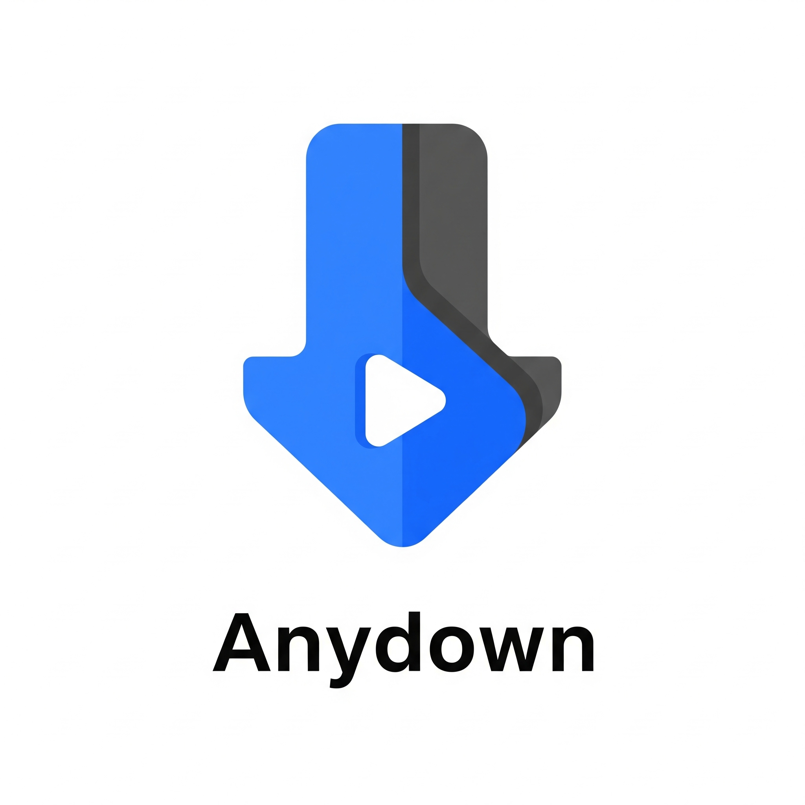

# Anydown - 一款现代化的 M3U8 下载器



**Anydown** 是一款基于 Flutter 构建的、美观且强大的 Windows 桌面应用，旨在为 **[N_m3u8DL-RE](https://github.com/nilaoda/N_m3u8DL-RE)** 这款出色的命令行下载工具提供一个现代化的图形用户界面（GUI）。

它将 `N_m3u8DL-RE` 强大的功能与 Flutter 优雅的 UI 相结合，让普通用户也能轻松享受专业级的流媒体视频下载体验。

---

## ✨ 功能亮点

- **现代化的用户界面**：采用 Flutter 构建，拥有流畅、美观且响应迅速的操作界面。
- **多任务并行下载**：支持同时添加和下载多个 M3U8 任务，充分利用您的网络带宽。
- **清晰的进度展示**：每个任务都拥有独立的进度条，实时显示百分比、分片进度、已下载/总大小、速度和预计剩余时间。
- **全局设置中心**：
    - **下载设置**: 自定义下载线程数、重试次数、并发数。
    - **网络设置**: 全局限速、HTTP 超时、系统代理、自定义代理和请求头。
    - **文件设置**: 自定义临时文件目录、下载完成后自动删除临时文件等。
    - **高级配置**: 字幕格式、解密引擎、日志级别等高级选项。
- **灵活的任务管理**:
    - **自定义路径与命名**: 可为每个任务指定保存路径和文件名。
    - **任务控制**: 可随时取消正在进行中的任务。
    - **列表清理**: 可轻松删除已完成、失败或已取消的任务记录。
    - **日志查看**: 每个任务都附带详细的日志窗口，方便排查问题。
- **优雅的导航与布局**：采用可折叠的侧边导航栏，结构清晰，轻松在下载、设置和关于页面之间切换。
- **便携式应用**: 支持打包为无需安装的“绿色版”，解压即用。
- **开源许可展示**: 自动收集并展示所有用到的开源组件许可证，尊重并感谢开源社区。

---

## 📸 应用截图

*在这里替换成您的应用截图。漂亮的截图能极大地吸引用户。*

**(主下载界面截图)**


**(设置中心截图)**


---

## 🚀 如何使用

### 对于普通用户

1.  前往本项目的 **[Releases 页面](https://github.com/你的用户名/你的项目名/releases)** (请替换成您的链接)。
2.  下载最新版本的安装包（例如 `anydown_setup_vX.X.X.exe`）或便携版压缩包（`.zip` 文件）。
3.  **安装版**: 双击运行安装包，根据向导完成安装。
4.  **便携版**: 将 `.zip` 文件解压到任意位置，双击运行 `anydown.exe` 即可。

### 对于开发者

如果您希望从源码构建本项目，请遵循以下步骤：

1.  **准备核心下载器 `N_m3u8DL-RE`**
    - 首先，您需要构建其核心 `N_m3u8DL-RE.exe`。请参考 [N_m3u8DL-RE 的官方仓库](https://github.com/nilaoda/N_m3u8DL-RE) 指南进行构建。
    - 构建完成后，将 `N_m3u8DL-RE` 的 `Release` 目录下的所有文件复制到本 Flutter 项目的 `assets/downloader/` 目录下。
    - **重要**: 将 `N_m3u8DL-RE.exe` 重命名为 `m3u8.exe`。

2.  **准备 Flutter 环境**
    - 确保您已安装 Flutter SDK (推荐 3.x 或更高版本) 并配置好环境变量。
    - 确保您已启用 Flutter for Windows Desktop 开发支持。
    - [启用开发者模式](https://learn.microsoft.com/zh-cn/windows/apps/get-started/enable-your-device-for-development) 以支持符号链接。

3.  **构建并运行**
    ```bash
    # 克隆本项目
    git clone [https://github.com/你的用户名/你的项目名.git](https://github.com/你的用户名/你的项目名.git)
    cd 你的项目名

    # 获取 Flutter 依赖
    flutter pub get

    # 在 Debug 模式下运行
    flutter run -d windows
    ```

4.  **打包**
    ```bash
    # 构建发布版（绿色版）
    flutter build windows

    # 如果需要创建安装包，请使用 Inno Setup 和项目中的 installer_script.iss 脚本
    ```

---

## 🛠️ 技术栈

- **UI 框架**: [Flutter](https://flutter.dev/)
- **核心下载器**: [.NET](https://dotnet.microsoft.com/) / [N_m3u8DL-RE](https://github.com/nilaoda/N_m3u8DL-RE)
- **状态管理**: [Provider](https://pub.dev/packages/provider)
- **打包工具**: [Inno Setup](https://jrsoftware.org/isinfo.php)

---

## 🤝 如何贡献

欢迎任何形式的贡献！如果您有好的建议、发现了Bug或者希望添加新功能，请随时提交 Pull Request 或创建 Issue。

1.  Fork 本仓库
2.  创建您的功能分支 (`git checkout -b feature/AmazingFeature`)
3.  提交您的更改 (`git commit -m 'Add some AmazingFeature'`)
4.  推送到分支 (`git push origin feature/AmazingFeature`)
5.  打开一个 Pull Request

---

## 📄 许可证

本项目采用 [MIT 许可证](LICENSE)。

核心下载器 `N_m3u8DL-RE` 也采用 MIT 许可证。应用内使用的所有开源组件的许可证信息都可以在“关于”页面的“查看开源许可”中找到。